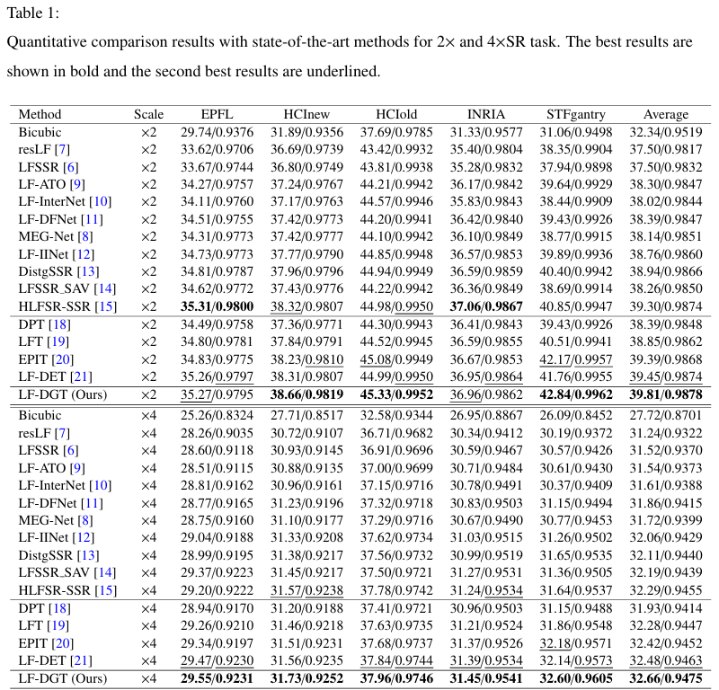

# LF-DGT

The official implementation of our paper "*Multi-level Disparity-Guided Transformers for Light Field Spatial Super-Resolution*".


## Dependencies

* Python 3.8
* CUDA 11.8
* Pytorch 2.3.1
* torchvision 0.18.1
* scikit-image 0.19.0
  
## Datasets

Following [BasicLFSR](https://github.com/ZhengyuLiang24/BasicLFSR), we use five datasets, including EPFL, HCInew, HCIold, INRIA and STFgantry for training and testing. Please download the datasets in the official repository of [BasicLFSR](https://github.com/ZhengyuLiang24/BasicLFSR).

## Models

* The `pre` directory contains **our pretrained models**, including:
  * The `_train` checkpoints saved at the end of training for further fine-tuning, and
  * The `_test` versions where the FFN mid-layers have been fused (for inference, all parameters are merged into a single 3×3 standard convolution layer `W_fused` to ensure efficiency).
  * Default configurations support both **2× SR and 4× SR**.


## Train

- Run

```python
python train.py
```

- The specific configuration information is in `option.py` which can be changed.

## Test

- Run

```python
python test.py
```

- The specific configuration information is in `option.py` which can be changed.

## Results



## Acknowledgement

Our work and implementations are inspired and based on the following projects:

- [BasicLFSR](https://github.com/ZhengyuLiang24/BasicLFSR)
- [LF-DET](https://github.com/Congrx/LF-DET)
- [RGT](https://github.com/zhengchen1999/RGT)


## Citation


## Contact

Please contact me if you have any questions at: [ygliao@tju.edu.cn](mailto:ygliao@tju.edu.cn) .

